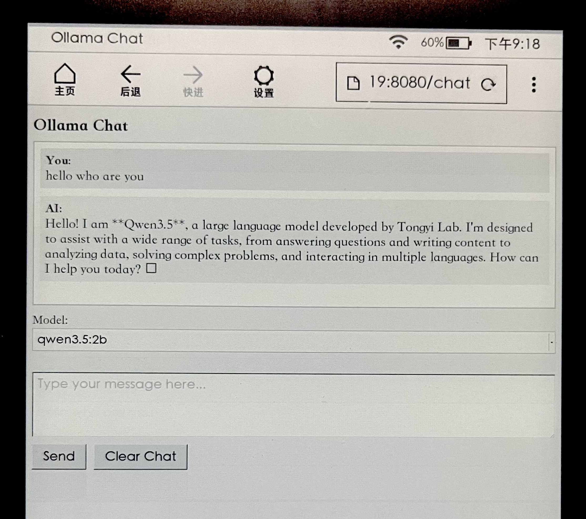

# Kindle Ollama Chat

A lightweight web-based chat UI for [Ollama](https://ollama.com), designed to run on a local machine and be accessed from a **Kindle's basic browser** over home WiFi.

Built with pure Python stdlib + the `ollama` package — no Flask or heavy frameworks needed.

## Demo



## Requirements

- Python 3.8+
- [Ollama](https://ollama.com) running locally
- At least one model pulled in Ollama (e.g. `ollama pull qwen3.5:2b`)

## Setup

```bash
pip install -r requirements.txt
```

## Usage

```bash
python3 server.py
```

Then open your Kindle browser (or any browser on the same network) and navigate to:

```
http://<your-machine-ip>:8080
```

## Configuration

Edit the top of `server.py` to change defaults:

| Variable        | Default        | Description                        |
|-----------------|----------------|------------------------------------|
| `HOST`          | `0.0.0.0`      | Listen on all network interfaces   |
| `PORT`          | `8080`         | Web server port                    |
| `DEFAULT_MODEL` | `qwen3.5:2b`   | Fallback model if none found       |

## Features

- Model selector — lists all models available in your local Ollama instance
- Conversation history maintained per server session
- Clear Chat button to reset the conversation
- No JavaScript — works with Kindle's basic browser
- Large fonts optimized for Kindle e-ink screen

## Hardware

Tested on:
- **Server:** NVIDIA Jetson AGX Orin (Ubuntu)
- **Client:** Kindle (basic browser over WiFi)
